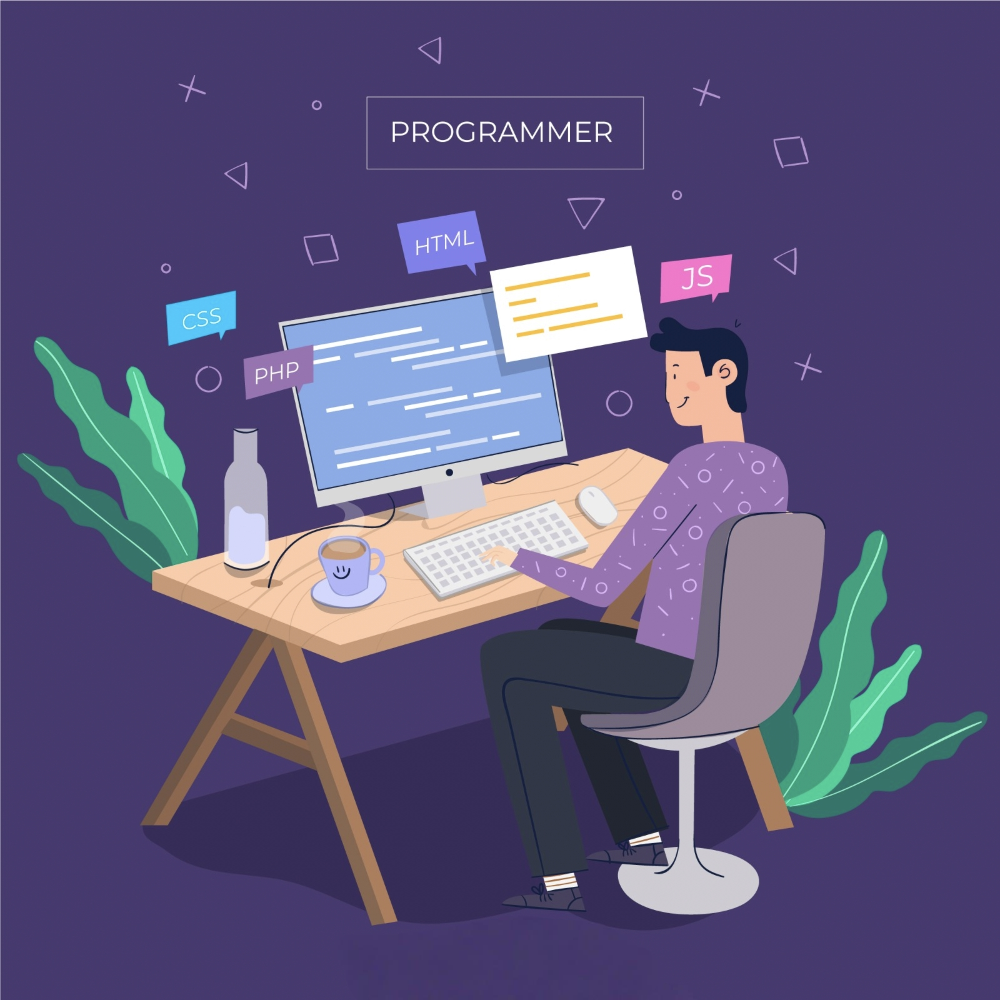

# Hi there, I'm Nikhil Sai Mandava 👋 
### Software Engineer ➔ DevOps & Cloud Enthusiast

I am a Software Engineer with **2+ years of experience** building robust applications using Java and Spring Boot. Currently, I am channeling my passion for automation, scalability, and infrastructure to transition into a **Full-Time DevOps & Cloud Engineer**. 

  

I love breaking down complex architectures, automating tedious pipelines, and deploying containerized applications. I'm actively looking to collaborate on open-source DevOps and Cloud projects!

---

## 🛠️ Tech Stack & Ecosystem

### 💻 Application Development
  

### 🚀 DevOps & Cloud Infrastructure
   

---

## ✍️ Latest From My Medium Blog
<!-- START_BLOG_POSTS -->
I write about Java, CI/CD pipelines, containerization, and my cloud journey. 
👉 Check out my deep dives on [My Medium Profile](https://medium.com/@nikhilsaimandava26).
<!-- END_BLOG_POSTS -->

---

## 🌐 Connect With Me

  
  
  

---

  

